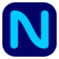

# NautaConnect for Chrome & Firefox

**Connect, disconnect and track your Nauta session — without keeping that portal tab alive.**

---

Every Nauta user in Cuba has lived this horror story: you close the portal tab (or the browser crashes), the logout button is gone forever, and your paid hours quietly bleed out. 💸

**NautaConnect turns your browser into the remote control for your Nauta session:**

- 🔌 **Connect & disconnect in one click** from the toolbar popup — the login form never has to load again.
- ⏱ **Session timer on the toolbar badge** — how long you've been online, always visible.
- ⌛ **Remaining account time** fetched straight from the portal.
- 🚪 **Logout that always works** — the session tokens are saved, so you can disconnect even after closing every tab or restarting the browser.
- 🌐 **Español e inglés** — switch anytime in the options page.
- 🪶 **Zero dependencies, no build step** — a few KB of vanilla JavaScript. Nothing phones home.

> Works with **Nauta Hogar** and **Nauta WiFi** accounts on any ETECSA network that authenticates through [secure.etecsa.net](https://secure.etecsa.net:8443/).

## Install

**Chrome / Chromium / Edge / Brave**
1. Download the latest `nautaconnect-chrome.zip` from [Releases](../../releases) and unzip it (or clone this repo).
2. Open `chrome://extensions`, enable **Developer mode**, click **Load unpacked**, pick the folder.

**Firefox**
1. Download `nautaconnect-firefox.zip` from [Releases](../../releases).
2. Open `about:debugging#/runtime/this-firefox` → **Load Temporary Add-on** → pick the zip.

Then click the NautaConnect icon, open **Settings**, save your `usuario@nauta.com.cu` credentials, and hit **Connect**. Store listings are on the roadmap.

Everything technical — protocol, architecture, packaging — lives in **[SPECS.md](SPECS.md)**.

## Roadmap

- [x] Connect / disconnect / session timer / remaining time
- [ ] Chrome Web Store & Firefox Add-ons listings
- [ ] Notifications before your time runs out
- [ ] [nauta.cu](https://www.nauta.cu/) user portal integration — balance, recharges and transfers from the popup

## Sister projects

NautaConnect is a family of small native apps, one per platform, no shared bloat:

- **[nautaconnect-macos](https://github.com/albertolicea00/nautaconnect-macos)** — native menu bar app for macOS
- **[nautaconnect-windows](https://github.com/albertolicea00/nautaconnect-windows)** — native system-tray app for Windows

## Contributing

Bugs, ideas and PRs are very welcome — see [CONTRIBUTING.md](CONTRIBUTING.md).

## Disclaimer

NautaConnect is an independent open-source project. It is **not** affiliated with, endorsed by, or supported by ETECSA. It simply automates the same requests your browser already makes against the official portal. Use it with your own account, at your own risk.

## License

Licensed under the [MIT](LICENSE) License.
